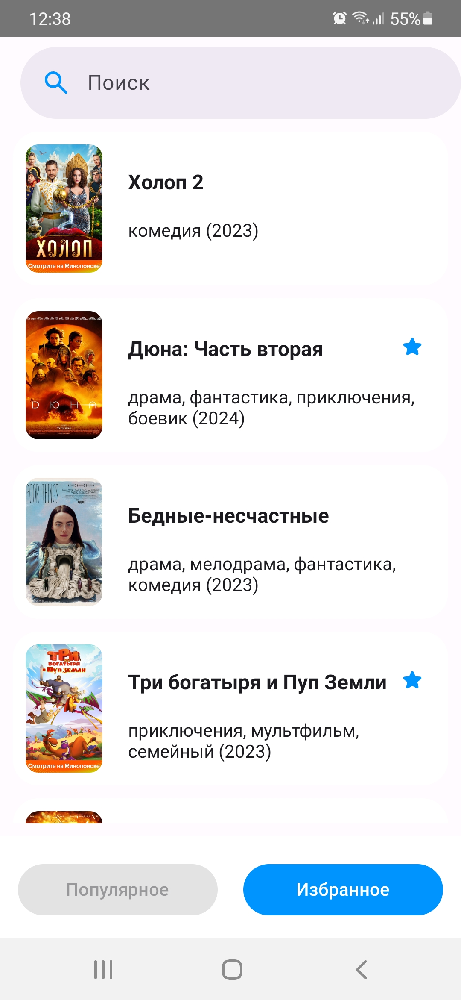
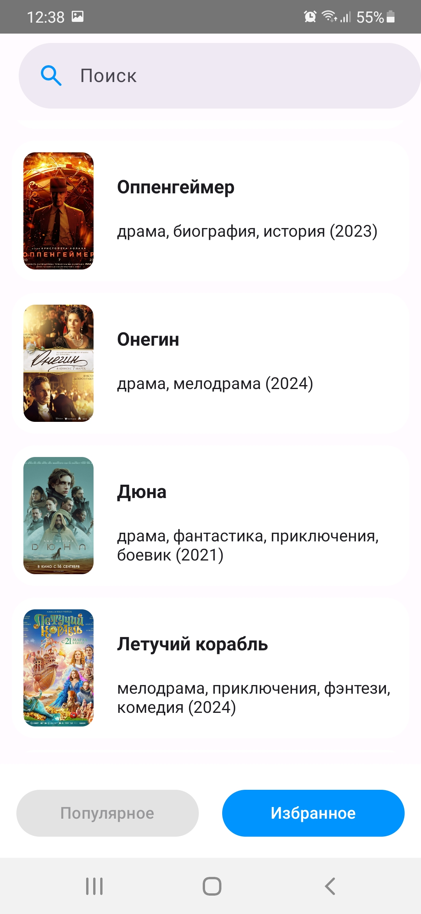
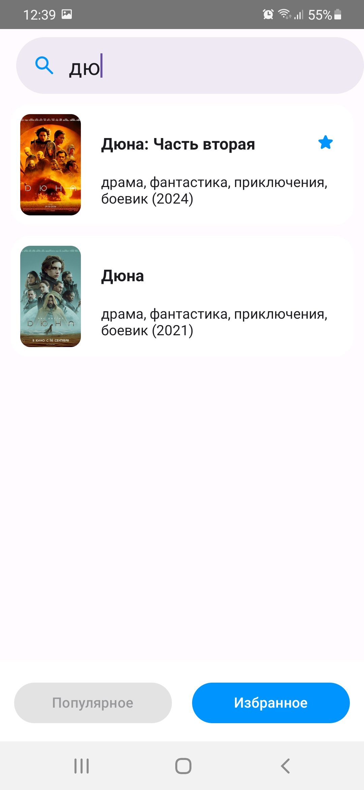
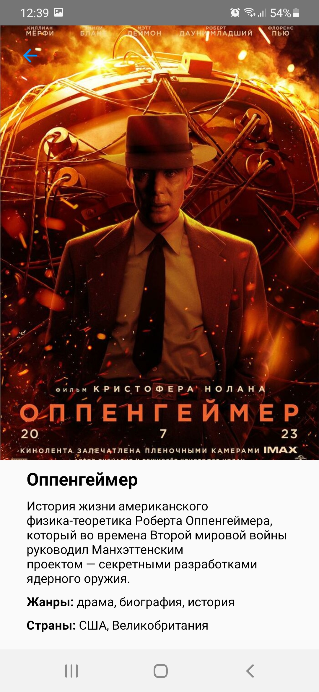

# TopListKinopoisk

Application allows watch popular movies, received from https://www.kinopoisk.ru. Movies present in list view. At click by movie, open movie detail description. In application have two sections:
- Popular - show popular movies, received from https://www.kinopoisk.ru.
- Favorites - show movies, which store in application database.

At long click movies adding/deleting from application database. If them not have, they add, if they have in database, then delete.

In sections Popular and Favorites realize movies search by movie name.

If network is unavailable, then three scenarios are possible:
- show movies from last network query.
- if not have network queries, then show movies from section Favorite.
- if not have movies from section Favorite, then show  error screen, with capabitity make another network query.

Application writed at Kotlin, with usage next libraries: Coil, Retrofit, Dagger2, Jetpack Compose, Navigation Compose, Room. I used Clean Architecture as Application Architecture and architecture pattern MVVM.

Install application can with apk file, located in folder setup.

  
  
  
  
  

